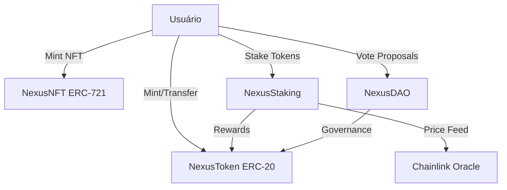

# Nexus Protocol - MVP Web3 🚀🦾

Este projeto é um protocolo descentralizado completo desenvolvido para a Unidade 1, Capítulo 5 da Fase 2 Avançada. O protocolo integra Tokens, NFTs, Staking e Governança com oráculos da Chainlink.

## 🏗️ Arquitetura do Protocolo

O Nexus Protocol é composto por 4 contratos inteligentes principais que interagem entre si para criar um ecossistema DeFi completo.



### Justificativas Técnicas
- **NexusToken (ERC-20)**: Utilizado como moeda nativa de governança e utilidade. O padrão ERC-20 da OpenZeppelin foi escolhido pela sua segurança comprovada e interoperabilidade.
- **NexusNFT (ERC-721)**: Utilizado para representação de ativos digitais exclusivos dentro do protocolo.
- **NexusStaking**: Mecanismo de incentivo para holders de NEX. Utiliza o **Price Feed ETH/USD da Chainlink** para ajustar as recompensas dinamicamente conforme a volatilidade do mercado.
- **NexusDAO**: Sistema de governança simplificado onde o poder de voto é proporcional ao saldo de tokens NEX dos usuários.

## 🚀 Deploy em Testnet (Sepolia)

| Contrato | Endereço |
| :--- | :--- |
| **NexusToken** | `0x45e4abdB209993Ffb2aA14fA5bAD60e63F08723c` |
| **NexusNFT** | `0x84C6BDCb3f246ba8E89cDe12c6033223Cf4Aa735` |
| **NexusStaking** | `0xF3FaC53EA13a720eb0fd31bc0A30e8938fC752C4` |
| **NexusDAO** | `0xE84fA145556cB711503c55fd468beaB53be6fEf2` |

## 🛡️ Segurança e Auditoria

Os contratos foram desenvolvidos seguindo as melhores práticas:
- **Solidity 0.8.x**: Proteção nativa contra overflow/underflow.
- **Access Control**: Uso de `Ownable` para funções administrativas.
- **Proteção contra Reentrancy**: Lógica de "Checks-Effects-Interactions" aplicada em funções de transferência.

## 🛠️ Como Executar (Automação Master)

O projeto possui scripts de automação para facilitar o gerenciamento de toda a infraestrutura:

1. **Iniciar Tudo** (Docker + Frontend): `./start.sh`
2. **Parar Tudo**: `./stop.sh`

### Comandos Manuais (Se necessário):
- **Instalar dependências**: `npm install`
- **Executar testes**: `npx hardhat test`
- **Interação Web3**: `npx hardhat run scripts/interact.ts --network sepolia`

---
**Desenvolvido por:** Hobson Nascimento
**Professor:** Bruno Portes
```
