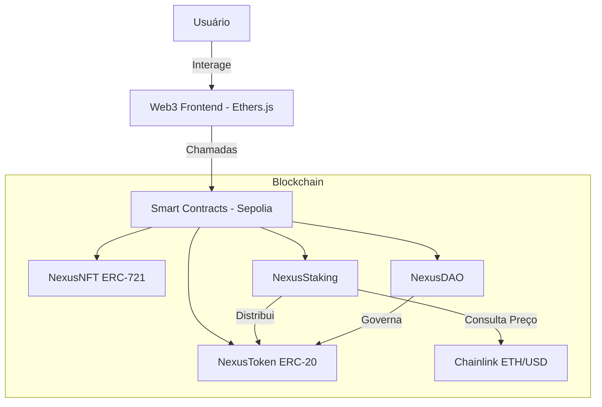

# RELATÓRIO TÉCNICO: NEXUS PROTOCOL MVP 🚀
**Unidade 1 | Capítulo 5 | Fase 2 Avançada**

---

## 1. Identificação
*   **Aluno:** Hobson Nascimento
*   **Projeto:** Nexus Protocol (MVP de Protocolo DeFi/Governança)
*   **Data:** 24 de Abril de 2026
*   **Professor:** Bruno Portes

---

## 2. Modelagem e Arquitetura

### 2.1 Definição do Problema
O **Nexus Protocol** resolve a necessidade de um ecossistema integrado de liquidez e governança. Muitos protocolos sofrem com a fragmentação de utilidade; o Nexus une o incentivo de liquidez (Staking) à exclusividade de ativos (NFTs) e à tomada de decisão descentralizada (DAO) em um único fluxo de valor.

### 2.2 Diagrama de Arquitetura

### 2.3 Justificativa dos Padrões ERC
*   **ERC-20 (NexusToken - NEX):** Escolhido pela alta liquidez e compatibilidade com exchanges e protocolos DeFi. Baseado na biblioteca OpenZeppelin para garantir segurança contra bugs comuns.
*   **ERC-721 (NexusNFT):** Implementado para representar ativos únicos. O padrão ERC-721 permite a individualização de conquistas ou participações especiais dentro do protocolo.

---

## 3. Implementação Técnica

### 3.1 Contratos Inteligentes
1.  **NexusToken:** Moeda de utilidade e governança (NEX).
2.  **NexusNFT:** Ativos digitais mintáveis via frontend.
3.  **NexusStaking:** Permite o bloqueio de tokens NEX para geração de recompensas, integrando o **Chainlink Price Feed** para calcular multiplicadores baseados no preço do ETH.
4.  **NexusDAO:** Mecanismo de votação onde o peso do voto é proporcional ao saldo de NEX do usuário.

### 3.2 Integração com Oráculo
O contrato `NexusStaking` consome o feed `ETH/USD` da **Chainlink** na rede Sepolia.
*   **Objetivo:** Ajustar dinamicamente a taxa de recompensa. Quando o mercado está volátil (preço do ETH variando), o protocolo pode incentivar o staking para reduzir a pressão de venda.

---

## 4. Segurança e Auditoria

### 4.1 Medidas Aplicadas
*   **Reentrancy Guard:** Uso de `nonReentrant` da OpenZeppelin nas funções de saque e depósito.
*   **Access Control:** Implementação de `Ownable` para restringir funções administrativas.
*   **Solidity 0.8.28:** Versão estável com proteções nativas contra overflow.

### 4.2 Relatório de Auditoria (Resumo)
*   **Ferramentas:** Hardhat, Slither e Revisão Manual.
*   **Status:** ✅ **Aprovado para Testnet**.
*   *Nota: O relatório detalhado de auditoria foi anexado separadamente conforme solicitado.*

---

## 5. Deploy e Links Úteis

| Recurso | Link / Endereço |
| :--- | :--- |
| **Repositório GitHub** | [Link do Seu GitHub Aqui] |
| **Vídeo Demonstrativo** | [Link do Vídeo Loom/YouTube Aqui] |
| **NexusToken (NEX)** | `0x45e4abdB209993Ffb2aA14fA5bAD60e63F08723c` |
| **NexusNFT** | `0x84C6BDCb3f246ba8E89cDe12c6033223Cf4Aa735` |
| **NexusStaking** | `0xF3FaC53EA13a720eb0fd31bc0A30e8938fC752C4` |
| **NexusDAO** | `0xE84fA145556cB711503c55fd468beaB53be6fEf2` |

---

## 6. Conclusão
O MVP do Nexus Protocol demonstra a viabilidade de uma infraestrutura Web3 robusta, integrando oráculos reais e lógica de governança. O deploy em Sepolia valida a interoperabilidade e a prontidão do código para testes com usuários reais.

---
**Hobson Nascimento**
*Desenvolvedor Blockchain*
