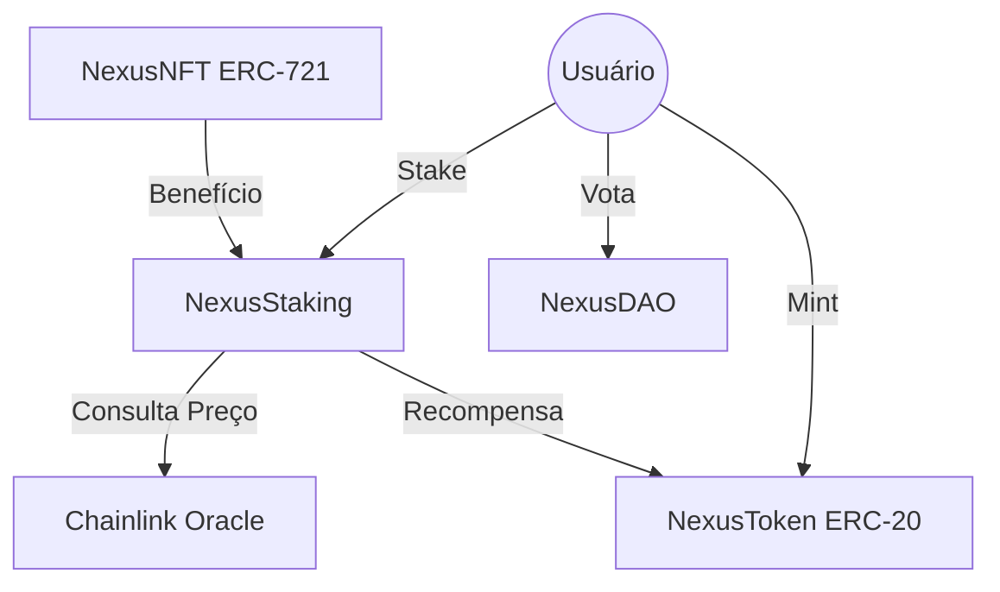

# Relatório Técnico: Nexus Protocol MVP

## 1. Definição do Problema
Muitos protocolos Web3 sofrem com a falta de incentivos dinâmicos que se adaptam às condições do mercado. O **Nexus Protocol** resolve isso integrando dados de oráculos externos para ajustar as recompensas de staking em tempo real, incentivando a retenção de tokens quando o mercado está volátil.

## 2. Arquitetura do Sistema

## 3. Justificativa dos Padrões ERC
- **ERC-20 (NexusToken):** Escolhido pela fungibilidade necessária para liquidez e staking.
- **ERC-721 (NexusNFT):** Utilizado para identificação única de membros, permitindo metadados específicos (badges) e benefícios exclusivos no protocolo.

## 4. Fluxo de Trabalho
1. O usuário adquire tokens NEX.
2. Faz o staking no contrato `NexusStaking`.
3. O oráculo Chainlink fornece o preço ETH/USD.
4. As recompensas são calculadas com base no preço e no tempo de stake.
5. O usuário utiliza seu saldo em stake para votar na `NexusDAO`.

## 5. Instruções de Deploy
1. Configurar o arquivo `.env`.
2. Executar `npx hardhat run scripts/deploy.ts --network sepolia`.
